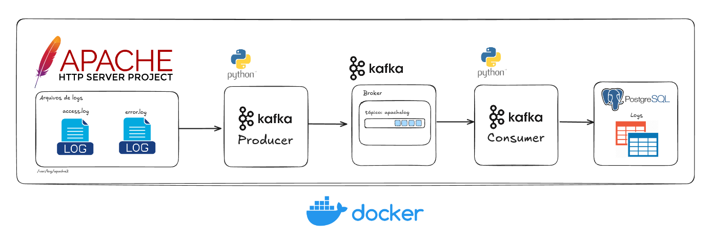

<h1 align="center">Projeto: Apache Kafka Log Pipeline</h1> 

> Objetivo: Criar um pipeline de dados escalável e em tempo real para processar e armazenar logs do servidor Apache HTTP utilizando Apache Kafka e PostgreSQL.

## Descrição

Este projeto cria um pipeline de dados utilizando Apache Kafka e PostgreSQL para capturar e armazenar logs do servidor Apache HTTP. O sistema utiliza dois componentes principais: um **produtor** que lê os logs de acesso do Apache e os envia para o Kafka, e um **consumidor** que lê os logs do Kafka e os insere no banco de dados PostgreSQL.

Principais características:
- Captura em tempo real de logs de acesso e erro do Apache
- Processamento assíncrono de logs usando Apache Kafka
- Armazenamento persistente em PostgreSQL para análise posterior
- Containerização com Docker para fácil implantação e escalabilidade
- Interface de gerenciamento de banco de dados com PgAdmin

## Arquitetura



## Componentes

1. **Apache HTTP Server**: O servidor web Apache gera arquivos de log (`access.log` e `error.log`).
2. **Kafka Producer**: Um script em Python que lê os logs do Apache e os publica em um tópico Kafka.
3. **Kafka Broker**: Intermediário que recebe as mensagens enviadas pelo produtor e as disponibiliza para os consumidores.
4. **Kafka Consumer**: Outro script Python que consome os logs do Kafka e os insere no banco de dados PostgreSQL.
5. **PostgreSQL**: Banco de dados relacional utilizado para armazenar os logs consumidos do Kafka.
6. **PgAdmin**: Interface web para gerenciamento do banco de dados PostgreSQL.
7. **Docker**: Usado para orquestrar todos os serviços (Apache, Kafka, PostgreSQL) em contêineres.

## Pré-requisitos

Certifique-se de ter os seguintes componentes instalados:

- [Docker](https://www.docker.com/get-started)
- [Docker Compose](https://docs.docker.com/compose/install/)
- [Python 3.x](https://www.python.org/downloads/)

## Configuração

### Passos para rodar o projeto

1. Clone o repositório:

   ```bash
   git clone <URL-do-repositorio>
   cd <diretorio-do-projeto>
   ```

2. **Crie o arquivo `.env`**

   Crie um arquivo `.env` na raiz do projeto com as seguintes informações de configuração:

   ```bash
   # Kafka configuration
   KAFKA_SERVER=localhost:9092
   KAFKA_TOPIC=apachelog

   # PostgreSQL configuration
   POSTGRES_DB=kafkalog
   POSTGRES_USER=postgres
   POSTGRES_PASSWORD=postgres

   # PgAdmin configuration
   PGADMIN_DEFAULT_EMAIL=pgadmin4@pgadmin.org
   PGADMIN_DEFAULT_PASSWORD=postgres
   ```

3. **Instale as dependências do projeto**

   Antes de executar o script Python, instale todas as dependências listadas no arquivo `requirements.txt` com o seguinte comando:

   ```bash
   pip install -r requirements.txt
   ```

   O arquivo `requirements.txt` contém todas as bibliotecas necessárias para rodar o projeto, como `kafka-python`, `psycopg2`, e `python-dotenv`.

4. **Crie a tabela no PostgreSQL**

   Execute o seguinte comando SQL para criar a tabela de logs no PostgreSQL:

   ```sql
   CREATE TABLE apache_logs (
       id SERIAL PRIMARY KEY,
       ip VARCHAR(45),
       identity VARCHAR(255),
       username VARCHAR(255),
       timestamp TIMESTAMP,
       method VARCHAR(10),
       path TEXT,
       protocol VARCHAR(10),
       status VARCHAR(3),
       size BIGINT,
       referer TEXT,
       user_agent TEXT
   );

   CREATE TABLE apache_error_logs (
    id SERIAL PRIMARY KEY,
    timestamp TIMESTAMP,
    module VARCHAR(255),
    severity VARCHAR(255),
    message TEXT
);

   ```

5. **Iniciar o Docker Compose**

   Execute o comando abaixo para subir todos os serviços usando Docker Compose:

   ```bash
   docker-compose up -d --build
   ```

   Isso irá iniciar os contêineres Kafka, PostgreSQL e PgAdmin. Aguarde até que os serviços estejam ativos.

6. **Acessar o PgAdmin**

   Acesse o PgAdmin pelo endereço: [http://localhost:5050](http://localhost:5050)

   - Username: `${PGADMIN_DEFAULT_EMAIL}` (ou seja, o valor inserido no arquivo `.env`)
   - Password: `${PGADMIN_DEFAULT_PASSWORD}`

   Adicione uma nova conexão ao banco de dados:

   - **Aba General**: 
     - Nome: `db`
   - **Aba Connection**: 
     - Host: `db`
     - Username: `${POSTGRES_USER}`
     - Password: `${POSTGRES_PASSWORD}`
   
   Conecte-se ao banco de dados `kafkalog`.

7. **Executar o script Python**

   Após iniciar o ambiente Docker, você pode rodar o script que processa os logs do Apache e envia os dados para o Kafka e PostgreSQL com o seguinte comando:

   ```bash
   python app/connector_apache.py
   ```

   Este comando iniciará o conector, que vai ler os arquivos de log do Apache, enviar os dados para o Kafka, e o consumidor vai armazená-los no PostgreSQL.

8. **Verifique os logs**

   Os logs do Apache estarão sendo consumidos pelo Kafka e armazenados no PostgreSQL. Use o PgAdmin para consultar os logs na tabela `apache_logs`.

### Parar e Remover os Contêineres

- Para parar o ambiente Docker:

  ```bash
  docker-compose down
  ```

- Para remover os volumes (dados persistentes):

  ```bash
  docker-compose down -v
  ```

## Código Python

O arquivo principal que realiza a leitura dos logs do Apache e os envia ao Kafka está em `connector_apache.py`. Ele utiliza um `KafkaProducer` para publicar mensagens e um `KafkaConsumer` para lê-las e inseri-las no PostgreSQL. Certifique-se de ajustar as variáveis de configuração conforme necessário.

No arquivo `connector_apache.py`, o código foi ajustado para carregar as variáveis de ambiente a partir do arquivo `.env` usando `python-dotenv`. Isso garante que informações sensíveis, como credenciais do PostgreSQL e o endereço do servidor Kafka, não sejam expostas diretamente no código.

```python
import os
from dotenv import load_dotenv

# Carregar variáveis de ambiente do arquivo .env
load_dotenv()

# Configurações do Kafka
CONFIG = {
    'log_file_path': '/var/log/apache2/access.log',
    'kafka_server': os.getenv('KAFKA_SERVER'),
    'kafka_topic': os.getenv('KAFKA_TOPIC'),
    'sleep_time': 5,
}

# Configurações de conexão PostgreSQL
POSTGRESQL_CONFIG = {
    'dbname': os.getenv('POSTGRES_DB'),
    'user': os.getenv('POSTGRES_USER'),
    'password': os.getenv('POSTGRES_PASSWORD'),
    'host': os.getenv('POSTGRES_HOST', 'localhost'),
    'port': os.getenv('POSTGRES_PORT', '55432'),
}
```# Apache-Kafka-Log-Pipeline
